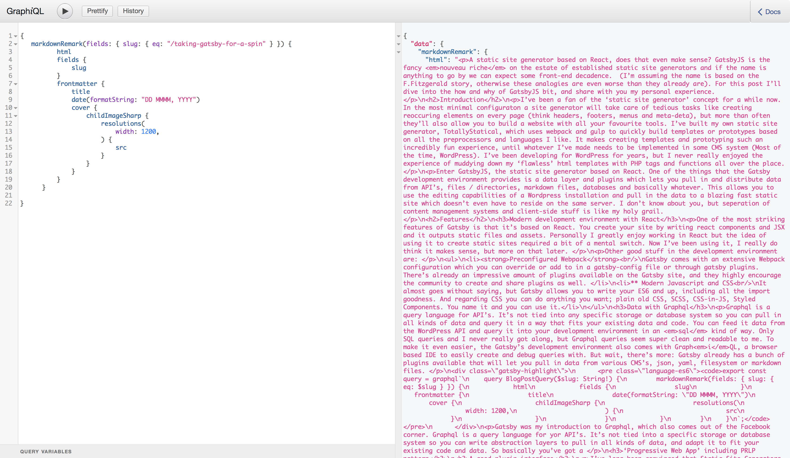

A static site generator based on React, does that even make sense? GatsbyJS tries to answer this question with a hyper modern, feature packed, *jamstacked* development tool that you can try out right now! In this post I'll give you a quick introduction and an overview of my own thoughts on Gatsby.

## Introducing: Gatsby
Ever since following the [Gatsby Twitter account](https://twitter.com/gatsbyjs) I've been wanting in on the action. It's not that I really *need* a new tool to create static sites with, it's just that every developer tweeting about Gatsby seems to think it's the most exciting thing on the web since they learned they could combine the `marquee` and `blink` tag. Call it FOMO. Also, the sites that these developers have been showcasing were all so fast and snappy, I had to see what the buzz was about. 
Some of the important features of Gatsby:

### React

GatsbyJS is based on React and means that you'll be writing almost everything in JavaScript / JSX to generate your HTML. That doesn't mean you need loads of React experience to start out with Gatsby, the [tutorials](https://www.gatsbyjs.org/tutorial/) are a great resource and will learn you some React along the way. If you already enjoy working with React, you'll most definitely enjoy creating static sites with Gatsby. As your final JavaScript bundle includes the React library as well, you can include React components as well. Of course those won't render with JavaScript disabled.

### Graphql

Gatsby has been my introduction to Graphql and I'm loving it already. Graphql is a query language which you can connect to all kinds of api's. With an abstraction layer you can pull in all the data you can think of and use it in your app while developing. Gatsby comes with plugins to pull in data from several API's, CMS systems and files. With Graphql you're able to query data from all these sources in a clear and readable way. The data is instantly available in your components and that's just super cool. Also, it comes with this browser based IDE called Graph*i*QL which starts along with your development environment. You can use it to test out the queries, see what data you have available and what everything returns exactly. 

<div class='caption'>


<p class='caption__text'>
    GraphiQL in action. Here we're quering a specific markdown file and some of its data. 
</p>
</div>

### Progressive Web App and PRPL Pattern (Blazing fast)
With an eye on the future, Gatsby already implements lots of Googles so called '**P**ush, **R**ender **P**re-Cache and **L**azy-load pattern (I'm not sure if that acronym will catch on). All of the pre-loading and code-splitting is basically already taken care of, which makes for an insanely fast experience when browsing around on Gatsby sites. PRPL + the gatsby offline plugin mean that your site will be considered a PWA, will load insanely fast on any device and scores great in Google lighthouse. 

### Webpack and Plugins
Can you say React without Webpack? I can hardly say `hello world` without webpack anymore, although I'm still not sure how it's configured. Gatsby comes with an extensive webpack configuration you don't really need to touch if you don't want to. If you do, you can modify and add to the default configuration with a plugin or in a `gatsby-node` file, which is also used to create nodes from your data points. There's already a great range of plugins available and there are some good examples on how to write your own plugin too. 

### Community
Even though Gatsby is young, the developers using it seem really involved. There are quite some articles on Gatsby, people seem to be happy to answer your Gatsby questions on Twitter and on Github you can ask anything without being shot down. Everyone is encouraged to contribute in form of plugins and pull requests, which gives me confidence that we'll see a lot of additions and improvements in the future. 


## Some thoughts on Gatsby

It's very telling that [most of the websites that are made with Gatsby](https://github.com/gatsbyjs/gatsby#showcase) are developer portfolios and documentation websites. That definitely isn't a bad thing, it just means it's very new and developers seem to test the water by using it on projects close to home. 

In any case, I'm having a blast working with Gatsby, and a few things popped in my head while working on this personal site. 

### It's fast
Gatsby definitely delivers on the speed part. Even though it spits out quite the JavaScript bundle, the navigating around feels so incredibly snappy and all the page speed tests seem to love what is going on. Most Gatsby sites also feel fast on spotty 3g connections, it's not just the tests. 

### GraphQL is amazing

My very first creation with Gatsby is my own site, which is always a work in progress. Even though I built my own static site generator, [TotallyStatical], I wanted to try out Gatsby because of its promise: Data from everywhere, static output. Although the data I pull in this blog is based on markdown files, it won't be hard to switch to another content source because of Graphql. This completely separates the front-end of a site from its content source and that's a concept I hope to see more often. 

<div class='caption'>

```es6
export const query = graphql`
    query BlogPostQuery($slug: String!) {
        markdownRemark(fields: { slug: { eq: $slug } }) {
            html
            fields {
                slug
            }
            frontmatter {
                title
                date(formatString: "DD MMMM, YYYY")
                cover {
                    childImageSharp {
                        resolutions(
                            width: 1200,
                        ) {
                            src
                        }
                    }
                }
            }
        }
    }
`;
```
<p class='caption__text'>
    Returning data from markdown files for the blogpost template
</p>
</div>

### Deployment and content management can be so good! 

After reading some articles on the Gatsby site, I decided to set up my Gatsby hosting on a free plan from [Netlify](https://www.netlify.com/) (which is ridiculously generous by the way, what's the catch?) and that has been a fun experience. Netlify already supports Gatsby out of the box, which means you can configure automatic deploys with `git` in a few clicks. Now everything I push to master, the site gets rebuild and uploaded by Netlify. Magic. There's also the possibility to configure staging servers based on your branches, so you can always test out your changes before merging to master and deploying.  

But wait, there's more. If you use [Contentful](https://www.contentful.com/) as Content Management System and Netlify as your host, you can easily create a Webhook to trigger a rebuild on every content update! I haven't tried this myself yet, but these posts by ** are great resources to get you going. At the moment of typing every triggered update requires a full rebuild of the site. A small site doesn't cost too long to be rebuild, but I can imagine it's quite much on a large site with many updates. Luckily, incremental builds will be part of Gatsby 'sooner than later', which will take care of that problem. 

### Gatsby Image plugin is cool
Did you see the SVG traced image before the image was loaded? If not, you're probably on Safari and I haven't implemented the `intersection observer` polyfill yet, but in any other cases images you add with the gatsby image component will have a blur or traced svg preloading effect by default. it also has srcet support and automatic WebP support. It can also use some work; Right now it will only show the preload image when JavaScript is disabled ([Pull request with a `noscript` tag is pending](https://github.com/gatsbyjs/gatsby/pull/3122_)). It also ads a few wrappers around your images that are hard to reconfigure without using `!important` and uses `object-fit` which is unsupported by IE11 and older by default. Of course, you don't have to use this plugin and every addition / change is discussable on Github. 

### Keep an eye on the output
I'll instantly admit that I haven't gone over my own site yet, but I'm sure it'll need some more work on the semantic HTML front. Unlike template languages like `pug` and `haml`, JSX makes it really easy to make a mess of your output. Combined with the use of plugins, I'd say it's extra important to keep an eye out on the output it generates, if it's accessible and actually progressive (meaning it still renders something good in older browsers and such). Because Gatsby seems very much about moving forward I think it's extra important to keep an eye out for enhancements that aren't progressive. 

### When your favorite tool is a hammer... 
Doing everything in React is a blessing and a curse. You can solve everything with JavaScript but that doesn't mean you HAVE to solve everything with JavaScript. At times I find myself in such a flow of writing just JavaScript that I tend to use it to solve problems that could've also been fixed with a `hover` selector in CSS. 

### CSS in JavaScript, I can dig it.
You can use anything to style your gatsby site with; CSS, SCSS, Styled Components, CSS-in-JS, you name it. I wanted to give the whole "Use CSS in your JavaScript" a spin this time so I chose for a library called `emotion-js` based on the fact that I dig the Bowie emoji a lot. I have to be honest with you, I don't hate it! Having a component and it's styling in one place is such a nice way to work. I don't even need all the clever tricks of using react state to toggle values, just the fact that everything is in the same place already makes thing sort of 'click'. Although there's still some work to do considering autocompletion and CSS syntax highlighting, I wouldn't mind working like this more often.


## In conclusion
I like Gatsby and I like the ideas that it promotes. The sites it create are blazing fast, the development environment is one big party and the data source and structure of that source is separated from the front-end. I am greatly looking forward to develop more sites with Gatsby and I'm going to look for professional opportunities where I can replace a traditional CMS installation with template to a Gatsby static site and a separate CMS. The combination of Contentful and Netlify already offers this, but I'm curious to see if I can pull it off with WordPress for example. I can already think of some challenges ahead, but seeing Gatsby is such a joy to use, I'll gladly take those on.

If you have any questions based on this post, don't hesitate to contact me on (Twitter)[http://twitter.com/ardennl] or via [mail](mailto:a.de.raaij@gmail.com). Thanks for reading! 

