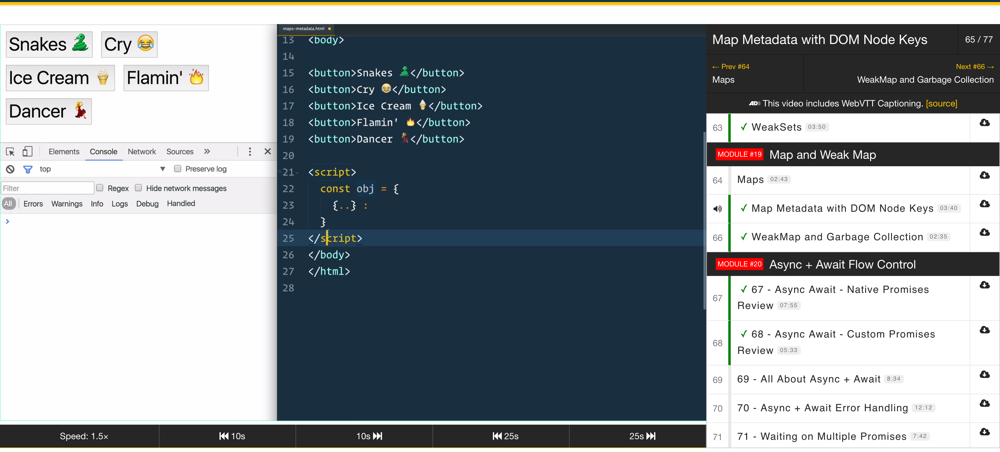

You can learn alot from code specifications, documentation and blog posts, but every now and then it’s really helpful to follow a structured course on a specific topic. That’s why, over the past year, I have invested some more time in following online courses. For this series I will do some write-ups and reviews on the courses I’ve tried. I’ll start out with *ES6 for everyone* by Wes Bos.

## Introduction
ES6 for everyone is a course focussed on, you guessed it, ES6 (Although, the naming of JavaScript standards is pretty confusing). The course is aimed at getting you to know all the useful new possibilities in JavaScript and how you can apply those at whatever you're working on every day. Besides teaching you loads of new stuff, the course is also aimed at developing and strengthening your basic JavaScript skills.

### Who's Wes Bos?
To be honest, I didn't do a great amount of research on Wes before I bought the course. Luckily it turns out Wes knows his stuff! If you've ever Googled for JavaScript solutions or looked for free courses, chances are high you've ended up on [his website](http://wesbos.com/) before. He has a bunch of helpful blog posts and free videos on JavaScript like [Javascript 30](https://javascript30.com/), a free 30 day vanilla js code challenge. If you want to do some fun JS projects and get to know his teaching style before you invest in ES6 for everyone, I highly recommend you to give Javascript 30 a try. Wes is also the host of [Syntax.fm](https://syntax.fm/), a weekly podcast on everything web development. If you’re interested in web development in any way, I suggest you [follow Wes Bos on twitter](https://twitter.com/wesbos). 

### Content and pricing
The ES6 course comes in two forms: The starter course which includes 7 modules (27 streamable videos), unlimited access to updates, all the source code and access to the ES6 for Everyone Slack channel. This'll set you back $89,-. 
For $139,- you get the full package which includes 21 modules (77 streamable and downloadable videos) with lessons about ES6 Classes, Generators and Proxies and ES2017 Async + Await. There are also options for team licenses and student discounts. When I was traveling, I noticed that Wes also offers discounts based on location, so called 'Parity Purchasing Power'. This makes the courses a lot more affordable and available for a lot of people around the world, and I think it's a great thing to do. Also, I didn't take advantage, I promise. 

### Video and Audio
The quality of the course material is impressive. The videos come with crystal clear audio and are superbly edited. It’s a far cry from when most of the courses were recorded with a laptop microphone. Wes obviously invested in a great audio setup which makes following a course that more enjoyable. 

The video player itself deserves a mention as well, as it has some very useful controls. Especially the controls to speed-up the videos are a blessing. When I (re)watch videos I mostly watch them at 1.5x or 2x speed and somehow my brain can cope with it. The audio doesn’t distort in a high-pitched chipmunk voice, that also helps. There are also controls to move forwards / backwards 10 or 25 seconds which are great to quickly skip something or if you’ve missed one of Wes’ his dad jokes 😂. 

## The course

The full course consists of 21 modules and 77(!) videos ranging in length from two to 12 minutes. I'm not sure how many minutes it is in total, but I do know that Wes will teach you how to calculate it with chaining a bunch of `Array methods`. There are videos on topics ranging from `const` and `let` to `async` and `await`. You'll learn about ES6 classes, generators, maps and sets, but also about tooling and linting. Check out the full course contents [here](https://es6.io/).

## Modules and videos

The course is divided into modules. These modules contain multiple videos on either a specific subject or  lots of subjects that are highly related. The course does follow a bit of a path and doing it from start to end feels very fulfilling. At the same time the modules allow for a choice of any topic you want and dive into any specific topic at any given moment.

Wes explains the subjects with real, or at least plausible, examples that show you where the methods, functions and all that other goodness will come in handy and why you should use them. Not all modules include exercises, but there are also plenty of other times where Wes will suggest you to pause the video and see if you can come up with your own solution before seeing his. The source code is available so you can poke around with all the results right away. Personally I remember what I've learned better when I write everything out myself, so I tend to type along with Wes and every now and then copy some stuff from the source files because, lazy. 

Both the duration of the videos and Wes’ upbeat teaching style makes it  so I never get bored or distracted while doing his courses. After about 5 modules in one sitting I notice that I start to zone out a bit, but seriously that's a lot of information! I’ve seen most of these videos more than twice by now, meaning that they’re still a great point of reference whenever you need a refresher on a specific topic. 

### Value and updates
That brings me to the value of this course, which is amazing (I'm starting to sound like a used car salesman). But for real, I bought this course in July 2016 and it's  still more than relevant enough to review almost a year and a half later. One reason that this course has so much replay value is the way it's cut up in modules and videos, making it great reference material for specific solutions and topics. Another reason for the replay value is that it contains an incredible amount of information. It would be impossible to go in-depth about everything, but Wes encourages you to look at the specs and docs.

There have been some great updates to the course as well, and everyone who bought the course gets access to all the updates. These updates can contain some small improvement to current videos but Wes also pulls out the big guns every once in awhile, and has added modules about async + await, ES7/ES8 and more. Talking about value! 

## In conclusion
Maybe you already gathered that I'm thoroughly impressed with this course. The modular structure, in-depth information, useful examples and Wes’ enjoyable way of teaching are what makes this course stand out. The perfect audio / video quality, great updates, and top-notch videoplayer are the finishing touches. 

ES6 for everyone is slightly pricey compared to some courses you can pick up on Udemy for $10,- but you get what you pay for though: Quality. Wes does his absolute best offering a decent price as well with Student discounts, frequent sales, team packages and parity purchasing power. 

When I look at the amount of knowledge I gained from the course and all the time I’ve spent studying with it, my student debts seem ridiculous.

ES6 for everyone is everything you need to get you up to date and confident in writing modern JavaScript. As it is now, the course will be a sound investment of your time and money for a while to come. 
