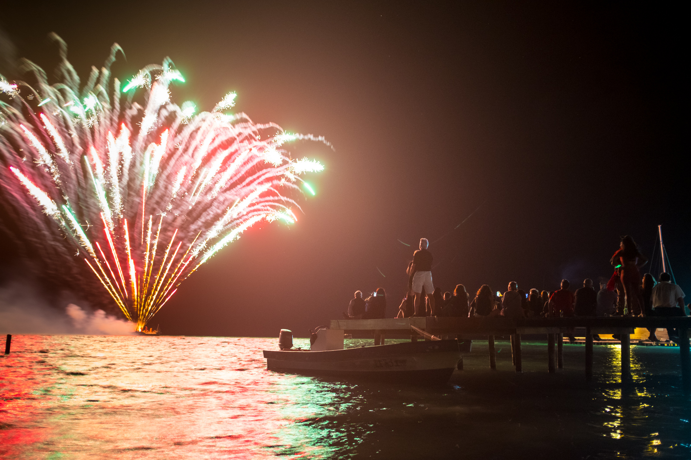
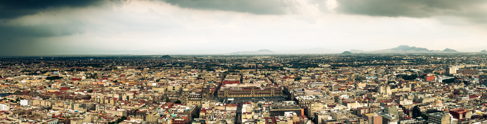
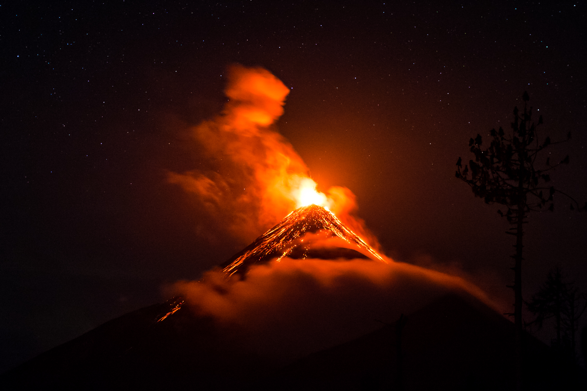
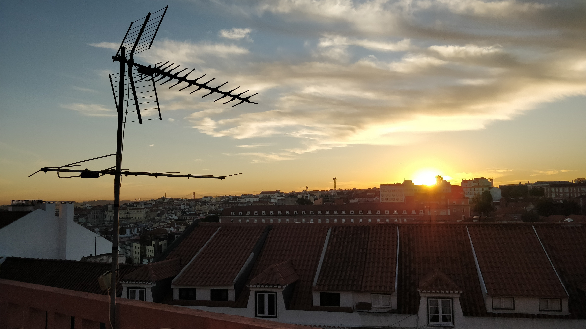

As a rule of thumb, year review articles are only okay to publish if you can still comfortably wish people a happy new year. The 20th of January should definitely not qualify, but my 2017 was pretty damn amazing and it would be a shame not to write down the gist of it, if even just for myself. So… Happy new year and enjoy this story of privilege.
I say privilege because while the world seemed to be on fire, my girlfriend Monika and I spent 2017 floating on cloud nine in places far from what we used to call home.
But the seeds for all that had already been planted in 2014 and 2015.

## Motive

The first seed was planted on a particular drab and grey November afternoon in Amsterdam. It was raining sideways and the lack of sunlight made the streets and buildings in our neighborhood appear even duller and than they usually do. My girlfriend Monika and I were staring out the window, feeling particularly uninspired when I said “Maybe we should just move to Lisbon” to which she replied “Fuck yeah!” without missing a heartbeat. Even though we didn’t immediately began planning a move, this small interaction between us felt a lot more real and serious than our usual winter-dreams about palm trees and white beaches.

The second seed was planted when we took a vacation to Colombia in February / March 2015. We took a month of from work and traveled across the country. We came across loads of travelers who were on the road for months and sometimes even years and I don’t think we have ever been more envious of other people. Before we came back in the Netherlands we had already decided that we would skip winter 2015 / 2016 and spend most of it in Latin America. When we got back, life got at us real fast and we postponed our trip to start in the winter of 2016, which came around in no-time.

## Travel

After saving up, we quit our jobs, threw away most of our stuff, rented out our apartment and left for Mexico City on the 9th of November (the day of Trump's election win of all days) and were not planning to come back until somewhere in May 2017.

Fast forward to New Years eve 2016: We were six weeks into our travels, just traded in Mexico for Caye Caulker Belize and drinking rum like we’re pirates with a bunch of new friends. We still had four and a half months left to get ourselves to Bogota, Colombia and there were plenty of adventures to be had.

    The new years eve fireworks show on Caye Caulker, Belize

I won’t turn this review in to a complete travel report (check my Instagram for a boatload of travel pictures) but wow, what a time. We..:

- Have seen more gorgeous sunsets and sunrises (mostly sunsets) than we imagined possible. They could never, ever bore us
- Have swam and surfed at beaches we could barely believe were real
- Spent a month in Xela (Quetzaltenango), Guatemala to learn spanish which was an experience never to forget (also, traveling became even more fun when we spoke the language so well)
- Hiked up to the summit of six volcanoes with Acatenango in Guatemala as absolute highlight.
- Made countless of friends

It’s almost pointless to sum our trip up in a few bullet points, so I’ll just stop insulting these memories, leave you with some photos and continue my story from when the second part of 2017 got defined.

    A view over the city that trumps all cities: Mexico City

    A view from the summit of Volcano Santa-Maria in Guatemala

    Driving up our rental Suzuki JimNy to the surfspot in Santa Theresa, Costa Rica

    Volcano 'Del Fuego' exploding in Guatemala, as seen from the summit of Volcano Acatenango.

*[Check my instagram for more pictures](https://www.instagram.com/ardennl/)*

In April 2017 we found ourselves in the midst of Nicaragua with only a few weeks left to get ourselves to Bogota, Colombia. That was quite a stretch because there were still so many places we wanted to see and visit. We checked our budget and we checked in with the airline and were able to extend our trip for six more weeks 🎉. At that moment it did hit us that we had to return to Amsterdam at some point, and that we weren’t really looking forward to pick-up where we had left off.

## Lisbon, Portugal

At that moment Monika and I decided to try out the water in Lisbon. After traveling through Central America, settling in Lisbon didn’t seem like a crazy thing to do.
Following the last leg of our trip which covered Costa Rica, Panama and Colombia, we flew back to Amsterdam in June, picked up some stuff and took a flight to Lisbon.

The first two weeks in Lisbon we stayed at the place of our good friend and his girlfriend, who were graceful enough to put up with us. Our initial plan was to stay in Lisbon for three months to decide if we really wanted to live here. Within days we realized that yes, indeed we want to live here and that three months isn’t enough to really test the waters anyway.
Monika found us an amazing apartment which we’re now renting for a year and we’ve barely looked back. She found herself a nice job here in Lisbon while I continued freelancing as front-end developer.

    Enjoying new places in our new hometown, every day is an adventure

## Work

Even though I hadn’t done much work as a freelancer since starting my last position at an agency in Amsterdam, clients still found me and as a result it was fairly simple to start up business again. As the cost of living in Portugal is lower than in the Netherlands I found myself working a bit less and spending more time studying (in the sun, no less) and working on things I enjoy; Getting myself totally up-to-date, filling in all the knowledge gaps and contributing a bit more to sharing stories and open source.

But I also found that I miss working in a team and long for a bit more high-impact work in which I can use all of the knowledge I’ve been gaining the past six months. That’s why I will be looking for a new challenge in 2018, although I’m not yet sure which form it’ll take.

## Recap

To sum it up: My girlfriend and I spend 2017 being decadent assholes making power-moves. We had great jobs in Amsterdam and no responsibilities whatsoever. Instead of using our savings as a down-payment on some equity like responsible people would do,  we decided to blow it all in the course of a year 🎉. It was glorious and I feel immensely grateful for all that we’ve experienced.

    Another sunset, this time from the rooftop terrace on our appartment building...

We’ve only been in Lisbon for six months but feel completely at home. There seems to be little chance we’ll move back north anytime soon although you never know what life might throw at you.

In any case, If 2018 is only half as good as 2017 was, It’ll be pretty damn awesome.
