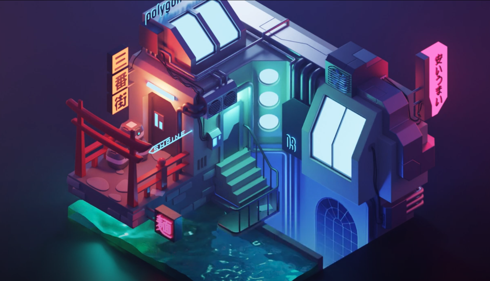
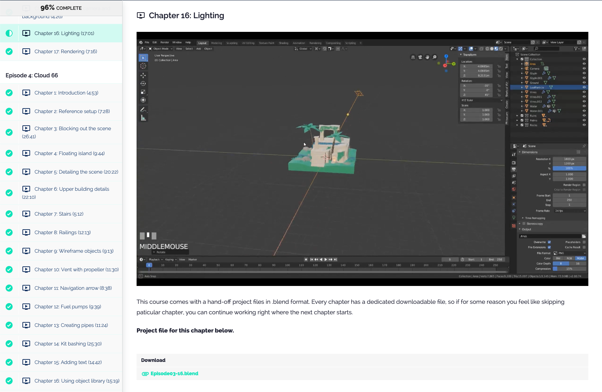
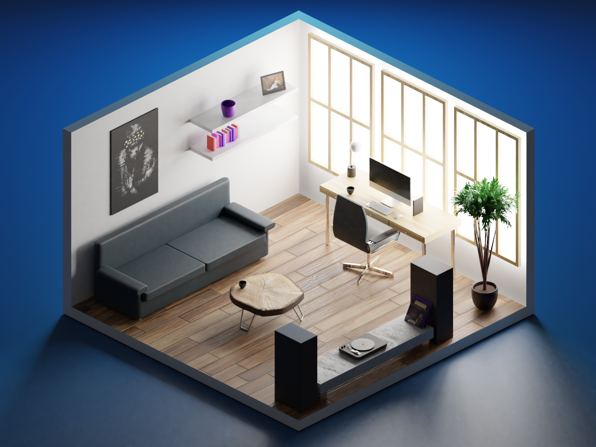

Web development is great, but adding the Z-axis to the mix gives it a whole new dimension!

Many people in my bubble have gotten the 3d spark by [Bruno Simon's ThreeJS course](https://threejs-journey.xyz/) ([which I've recently reviewed](/a-3-d-journey-with-threejs-journey-xyz)), an extensive course for the go-to 3d library on the web, ThreeJS. This course also includes an extensive lesson regarding Blender, a freely available 3d software suite with endless possibilities.

Naturally, a lot of people are looking for more Blender resources and when you search for those you'll inevitably come across the [Youtube channel](https://www.youtube.com/channel/UCGSJevmBuDyxjLLOBNaYMGA) and tutorials of [Polygon Runway](https://polygonrunway.com). Polygon Runway provides detailed progress and how-to videos on YouTube but their main products are extensive blender courses sold through their site. Today I'll be covering the 'Become a 3d Illustrator' course, which I recently completed and got a lot of questions about, mainly... is it worth it? A question that is not surprising as it does set you back a pretty penny.

## Introduction

Become a 3d Illustrator is a course introducing you to both the basic concepts of 3d illustrating as well as helping you with getting a handle on the Blender 3d Software suite.

Blender is available freely and used for many professional products, ranging from game design to animation movies to websites. It is not always the most intuitive software though, so picking it up on your own can be daunting.

The 'Become a 3d illustrator' course will guide you through the first steps of setting up Blender all the way to becoming somewhat of an expert with the basic techniques. You will also learn valuable basic concepts of (3d) illustrating which are not dependent on any specific application.

  A Cyberpunk Waterfront Scene made by Polygon Runway

### Who's Polygon Runway?

Polygon Runway is an educational channel of Roman Klčo, a designer and illustrator who's been in the business for over 15 years. He runs an amazing YouTube channel under the same name where you can pick up quick Blender tips or follow along as he makes entire 3d scenes in Blender, sometimes with commentary. If you want to get serious about 3d illustrating, he offers an impressive series of 3d video courses on polygonrunway.com of which 'Become a 3d Illustrator' is a famous one. The first module of this class is free under the name "become a 3d illustrator in one hour".

### Requirements

The course is created for beginners and you don't need any Blender experience to get started. You will need a computer that can run Blender and as my 2013 MacBook Pro can run it, I'm pretty sure a potato can too. Having a nice video card will help a lot with rendering speed though, this will be explained throughout the course and you can also find more information about compatible video cards on the [Blender requirements page](https://www.blender.org/download/requirements/).

What I do recommend is getting a simple three-button mouse (with scroll wheel), if you don't have one. It's possible to work in Blender with a trackpad and Roman will show you which settings to change. I tried, rage-quit after 20 minutes and ordered a cheap mouse online which does the job. Of course, something like a drawing tablet will work great as well.

## The Course

Screenshot from the course overview

In the "Become a 3d Illustrator" course you will make five different scenes using a whole range of different techniques. Each scene is made during one of the episodes and each episode is split up between different chapters with durations that range from a couple of minutes to about half an hour. That doesn't mean you'll be done with each chapter within the given time as you can endlessly noodle with details to make every scene your own. I spent half the day on some chapters that were supposed to take 12 minutes 😅.

What I greatly appreciate is that Roman always takes the time to share his thought process on how he gathers his inspiration, composes a scene, chooses his colours and lighting. This way you're not just following along to get proficient in a piece of software but you're learning valuable concepts from a design veteran that are not software dependent.

There's also a bunch of bonus content, including assets you can use in your own scenes and some excellent lessons on animations within Blender, which I thoroughly enjoyed.

<iframe width="560" height="315" src="https://www.youtube-nocookie.com/embed/F7nUgW30UFI" title="YouTube video player" frameborder="0" allow="accelerometer; autoplay; clipboard-write; encrypted-media; gyroscope; picture-in-picture" allowfullscreen></iframe>

Applying the animation bonus lessons to one of the scene got me this result! I made this! 

### Duration

There's about 20 hours worth of videos in the course. I easily spent the double amount on finishing up my scenes and will go back and do some again, albeit a bit more in my own way. All in all, you can go through the course from start to finish in a few weeks, spending a couple of hours a day on it.

### Support

This might be a testament to Roman's excellent teaching skills, but I've had no need for support whatsoever. Everything was clear right off the bat and I never questioned if I was doing things right or not. If you do need support, there is a Slack channel that I didn't yet join because Slack reminds me too much of work 😅.

What's also nice is that Roman genuinely loves to see what his students make and retweets their work often, something that can be motivating.

### Value for money

The course will set you back a pretty penny. It's 365 dollars or about 300 euro's, although it's a bit of a public secret you'll receive a good discount when finishing the free first episode of the course.

This money will get you approximately 20 hours of video, bonus material and assets, access to a private Slack channel, access to a Blender asset library and all the full scene assets that are made for the Polygon Runway YouTube videos.

If you spend a few hours a day on this course, you'll breeze through it in a couple of weeks, which might not seem like a lot. On the other hand, you can spend as much time as you want to noodle with your scenes and I find myself revisiting videos quite a bit in search of a specific technique I want to brush upon.

  Some of the bonus assets provided with the course

Another huge added value is being able to understand what techniques are used in the videos on the Polygon Runway youtube channel. As there is a new video published almost weekly (of which the assets are available to you if you signed up for this course) there is a huge amount of information and inspiration to be found in these. Knowing how Roman works and what techniques he uses, enables you to follow along and learn from these videos and turn the experience from "how the hell does he do that" to "Oh shit, I know how he does that!".

### Suggestions

On popular demand of exactly one(1) person going by the questionable name of 'Sweatythonk', here are a couple of suggestions which I, and they, think could make the course even better:

Transcriptions / written documentation. The course would be more accessible if the videos were transcribed or if there was written documentation in any form. At this point, searching for a specific workflow or technique means trying to remember in which episode you learned it, trying to find the right chapter and then sifting through the video to find the specific point which is tiresome. Also, I find reading a bit of text doesn't interrupt my workflow as much as having to start a video and search through it.

Another nice addition would be some cheatsheets with shortcuts/terminology. Yes, you'll be fluent in Blender shortcuts in no time thanks to this course, but every once in a while my brain short-circuits and I can't remember if CMD+R was for a loop-cut or a bevel and if I needed to be in object mode or in edit mode. And I know there are some nice cheatsheets out there, but it would be nice to have one in Polygon Runway style.

### Should you do this course?

As the absolute boring person I've become over the years, I can only tell you: It depends. It's not an absolute no-brainer like Bruno's ThreeJS Journey (which arguably is priced too low, I hope he doesn't read this) as a 300 bucks investment is nothing to sneeze at and there are plenty of resources out there that can teach you working with Blender.

On the other hand, it's a course given by someone who's not only an excellent designer but also an excellent teacher, teaching you over a decade of accumulated knowledge in a densely packed and immensely fun course. He's not just teaching you how Blender works, he's teaching you how to make 3d illustrations. As Roman mentions, you'll probably be able to pick up similar techniques on the interwebs but it will be nowhere near as structured and time-effective as doing this course.

I can gladly say that I enjoyed myself so much that I signed up for the follow-up course, 3d Characters and Illustrations, as well.

Of course, you will also have to think about what your own goals are. The Polygon Runway courses will teach you how to be comfortable in Blender and how to create just about anything. It will not teach you how to properly construct geometries to use in Three.js and you will need to try and experiment to adapt the scenes if this is your end product.

## In conclusion

'Become a 3d illustrator' by Polygon Runway is an exceptional amount of fun to follow and you will learn a lot. In the end, you'll feel comfortable working with Blender and inspired enough to create your own scenes. Roman is a great teacher who doesn't just let you follow along but also explains why he made certain choices and where and how he gets his inspiration.

The course is not cheap, so if you don't have the spare change lying around nor have the ambition to become an illustrator, I am not sure if you should save up for it. Instead, go look for some free resources including the [Polygon Runway Youtube channel](https://www.youtube.com/channel/UCGSJevmBuDyxjLLOBNaYMGA) to build up the skills you need

If you have the goal of becoming a 3d illustrator or use 3d illustrations for your work or hobbies often, or just want to enjoy yourself a great deal while making cool stuff, I can't recommend this course enough.

  Office Scene, also made by yours truly with the guiding hand of Polygon Runway!

## Links

- [Polygonrunway.com](https://polygonrunway.com)
- [Polygon Runway Youtube channel](https://www.youtube.com/channel/UCGSJevmBuDyxjLLOBNaYMGA)
- [Blender 3d Software ](https://www.blender.org/)
